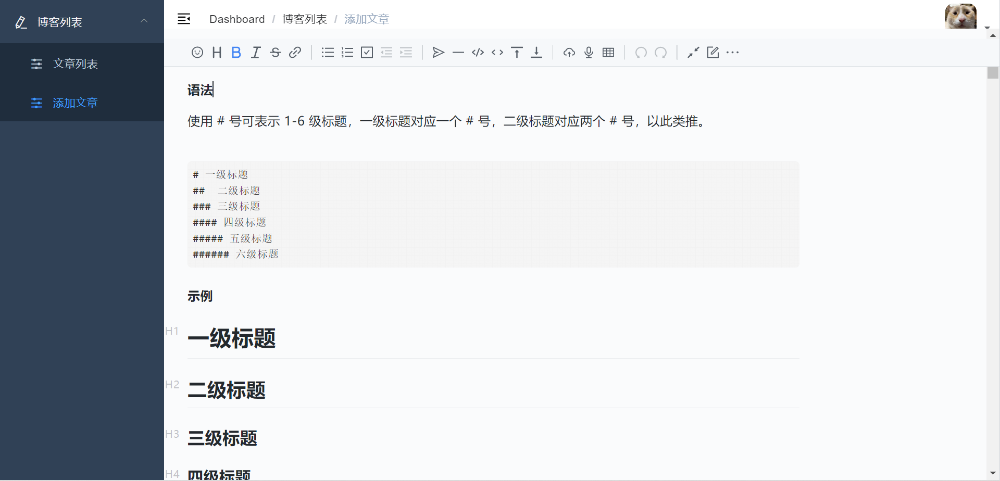
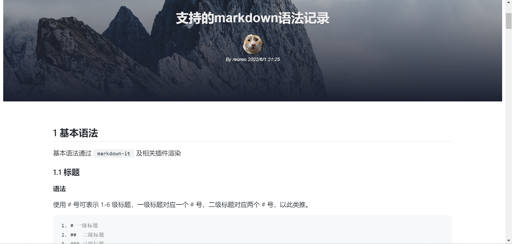

## a blog made with vue go

### preview

*login with vertify*


*admin*




*frontend*




### support

**admin**

* admin account token
* verify
* publish article

**frontend**

* display article

### plan next

* comment
* markdown render support more...

## use

```bash
cd admin
yarn dev
```

when you use backend,you should make dir `conf` in backend root,and set your config `app.ini`,like this:

```ini
#debug or release
RUN_MODE = debug

# random value
[app]
JWT_SECRET = ?

[server]
HTTP_PORT = 5200
READ_TIMEOUT = 60
WRITE_TIMEOUT = 60

[database]
TYPE = mysql
USER = your user name
PASSWORD = your user password
#127.0.0.1:3306
HOST = 127.0.0.1:3306
#数据库名
NAME = blog
#表名 blog_auth
TABLE_PREFIX = blog_
```

and run with:

```bash
cd backend
air
```

```bash
cd fronend
yarn dev
```

